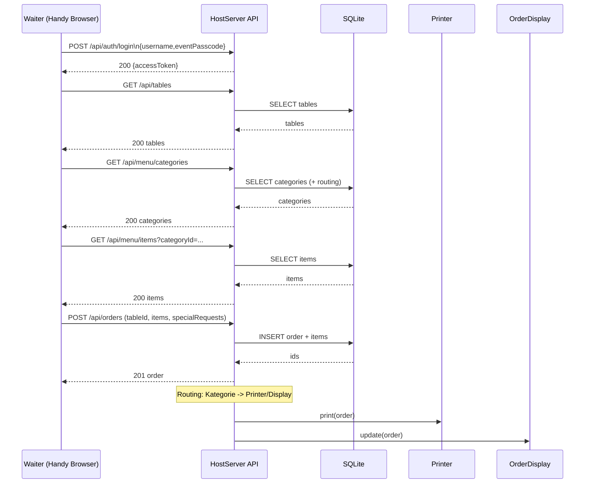

# API Endpoints (Planning)

> Ziel: Eine schlanke, ressourcenorientierte REST-API zwischen **Handy-Browser** / **Desktop App (WPF)** und **HostServer**.
> Fokus: Menü/Tische/User/Lager verwalten, Bestellungen aufnehmen, an Drucker/Displays routen.

---

## Überblick

- **Base URL (lokal/Host):** `http://{host}:{port}/api`
- **Content-Type:** `application/json; charset=utf-8`
- **Auth (Vorschlag):** JWT Bearer via `Authorization: Bearer <token>`
- **Error Format:** [`ProblemDetails`](https://datatracker.ietf.org/doc/html/rfc7807) (typisch ASP.NET)
- **Pagination (optional):** `?page=1&pageSize=50`
- **Sortierung (optional):** `?sort=weight,name` (kommagetrennt)

### Rollen (vereinfachter Vorschlag)
- `admin`: volle Rechte (Desktop)
- `waiter`: Bestellungen erstellen/sehen, Menü & Tische lesen (Handy)
- `readonly` (optional): nur lesen (z.B. Anzeige)

---

## Auth

### Auth Konzept (wichtig für dieses Projekt)
- **Waiter haben kein eigenes Passwort.**
- Login erfolgt über:
  - `username` (vom Waiter frei gewählt; eindeutig pro Event erwünscht)
  - `eventPasscode` (gemeinsamer Code, wird auf dem Laptop/Desktop angezeigt)
- Beim ersten Login kann der User serverseitig **automatisch angelegt** werden (wenn nicht vorhanden).

### POST `/auth/login`
Login (Handy-Browser / Desktop). Gibt Access-Token zurück.

**Request**
- body:
  - `username: string`
  - `eventPasscode: string`

**Response 200**
- body:
  - `accessToken: string`
  - `expiresInSeconds: int`
  - `refreshToken: string` *(optional, falls Refresh geplant)*
  - `user: UserDto` *(optional)*

**Statuscodes**: `200`, `400`, `401`

### GET `/auth/me`
Aktueller Benutzer.

**Auth:** `waiter/admin`

**Response 200**
- body: `UserDto`

### POST `/auth/refresh` *(optional)*
Neue Tokens.

### POST `/auth/logout` *(optional)*
Refresh-Token invalidieren.

---

## Users

> Users sind primär **Waiter-Identitäten** (username + lock). Passwörter werden **nicht** pro User gespeichert.

### GET `/users`
Liste der User.

**Auth:** `admin`

**Query**
- `locked=true|false`
- `search=<text>`

### POST `/users`
User anlegen (optional, da Auto-Create bei Login möglich).

**Auth:** `admin`

**Request**
- `username: string`
- `isLocked: boolean?`

**Statuscodes:** `201`, `400`, `409`

### GET `/users/{userId}`
**Auth:** `admin`

### PATCH `/users/{userId}`
User ändern (z.B. sperren/entsperren).

**Auth:** `admin`

**Request (Beispiele)**
- `{ "isLocked": true }`

**Statuscodes:** `200`, `400`, `404`, `409`

### DELETE `/users/{userId}`
**Auth:** `admin`

---

## Tables

### GET `/tables`
Tische abrufen.

**Auth:** `waiter/admin`

**Query (optional)**
- `locked=true|false`
- `sort=weight,name`

### POST `/tables`
Tisch anlegen.

**Auth:** `admin`

**Request**
- `name: string` *(z.B. "A1")*
- `weight: int?`
- `isLocked: boolean?`

**Statuscodes:** `201`, `400`, `409`

### POST `/tables/bulk`
Tischreihen erzeugen (z.B. A1–E5).

**Auth:** `admin`

**Request (Vorschlag)**
- `rows: string[]` *(z.B. ["A","B","C","D","E"])*
- `from: int` *(z.B. 1)*
- `to: int` *(z.B. 5)*
- `lockNew: boolean?`

**Statuscodes:** `201`, `400`, `409`

### PATCH `/tables/{tableId}`
Tisch ändern (z.B. sperren).

**Auth:** `admin`

### GET `/tables/{tableId}/qr`
QR Code für einen Tisch (als PNG/SVG).

**Auth:** `admin`

**Response**: `image/png` oder `image/svg+xml`

### GET `/tables/qr.pdf`
Alle Tische als PDF mit QR Codes exportieren.

**Auth:** `admin`

---

## Menu

### GET `/menu/categories`
Kategorien abrufen.

**Auth:** `waiter/admin`

**Query (optional)**
- `locked=true|false`
- `includeRouting=true|false` *(Printer/Display mitgeben)*

### POST `/menu/categories`
Kategorie anlegen.

**Auth:** `admin`

**Request**
- `name: string`
- `description: string?`
- `weight: int?`
- `isLocked: boolean?`
- `printerId: int?`
- `orderDisplayId: int?`

**Statuscodes:** `201`, `400`, `409`

### PATCH `/menu/categories/{categoryId}`
Kategorie ändern (inkl. Sperren und Routing).

**Auth:** `admin`

### DELETE `/menu/categories/{categoryId}`
**Auth:** `admin`

**Hinweis:** ggf. `409` wenn noch `MenuItems` enthalten.

---

### GET `/menu/items`
Menüitems abrufen.

**Auth:** `waiter/admin`

**Query (optional)**
- `categoryId=<id>`
- `locked=true|false`
- `sort=weight,name`

### POST `/menu/items`
Item anlegen.

**Auth:** `admin`

**Request**
- `name: string`
- `description: string?`
- `price: number`
- `weight: int?`
- `isLocked: boolean?`
- `menuCategoryId: int`

**Statuscodes:** `201`, `400`, `409`

### PATCH `/menu/items/{menuItemId}`
Item ändern (inkl. Kategorie wechseln / sperren).

**Auth:** `admin`

### DELETE `/menu/items/{menuItemId}`
**Auth:** `admin`

---

## Stock / Lager

### GET `/stock/items`
Lagerartikel abrufen.

**Auth:** `admin`

### POST `/stock/items`
Lagerartikel anlegen.

**Auth:** `admin`

**Request**
- `name: string`
- `quantity: int`

### PATCH `/stock/items/{stockItemId}`
Bestand ändern.

**Auth:** `admin`

**Request (Beispiele)**
- `{ "quantity": 42 }`
- `{ "delta": -3 }`

### PUT `/menu/items/{menuItemId}/stock-requirements`
Abhängigkeiten MenuItem ↔ StockItems ersetzen.

**Auth:** `admin`

**Request**
- `requirements: [ { "stockItemId": int, "quantityRequired": int } ]`

**Statuscodes:** `200`, `400`, `404`

---

## Devices (Printers / OrderDisplays)

### GET `/printers`
**Auth:** `admin`

### POST `/printers`
**Auth:** `admin`

**Request**
- `name: string`
- `ipAddress: string`
- `connectionDetails: string?`

### POST `/printers/{printerId}/test-print`
Testdruck.

**Auth:** `admin`

**Statuscodes:** `200`, `404`, `409`

---

### GET `/order-displays`
**Auth:** `admin`

### POST `/order-displays`
**Auth:** `admin`

---

## Orders (Bestellen/Verlauf)

### GET `/orders`
Bestellungen suchen (Verlauf / Übersicht).

**Auth:** `admin` *(oder `waiter` mit Einschränkung)*

**Query (optional)**
- `tableId=<id>`
- `userId=<id>`
- `from=2026-02-11T00:00:00Z`
- `to=2026-02-11T23:59:59Z`

### POST `/orders`
Neue Bestellung anlegen (Handy-Browser).

**Auth:** `waiter/admin`

**Request**
- `tableId: int`
- `items: [ { "menuItemId": int, "quantity": int, "specialRequests": string? } ]`

**Response 201 (Vorschlag)**
- `id: int`
- `timestamp: string`
- `tableId: int`
- `userId: int`
- `items: [...]`

**Statuscodes / Edge Cases**
- `201` ok
- `400` Validierung (quantity <= 0, leere items)
- `404` table/menuItem nicht gefunden
- `409` table/menuItem/category gesperrt (`isLocked=true`)
- `422` out-of-stock (wenn Lagerprüfung aktiv)

### GET `/orders/{orderId}`
Details inkl. Items.

**Auth:** `admin` *(oder `waiter` eingeschränkt)*

### POST `/orders/{orderId}/dispatch`
Triggert Drucken/Displays (falls nicht automatisch bei `POST /orders`).

**Auth:** `admin`

---

## Checkout / Rechnung (Planung)

> Wird noch nicht implementiert, daher nur grobe Planung. Ziel: Order als "abgerechnet" markieren, Totals berechnen, ggf. Splitten (pro Person) und Zahlungsart speichern.

> Im Mindmap erwähnt: Wechselgeldrechner / pro Person abrechnen. Das ist noch nicht im ERD, daher als **Planungs-API**.

### POST `/orders/{orderId}/checkout`
Berechnet Totals und markiert Order als abgerechnet.

**Auth:** `waiter/admin`

**Request (Vorschlag)**
- `split: [ { "label": "Person 1", "amount": number } ]?`
- `paymentMethod: "cash"|"card"|"mixed"`

**Statuscodes:** `200`, `400`, `409` *(already checked out)*

### GET `/orders/{orderId}/receipt`
Receipt als JSON.

### GET `/orders/{orderId}/receipt.pdf`
Receipt als PDF.

---

## Configurations / Admin / Event

### GET `/config`
Alle Konfigurationen.

**Auth:** `admin`

### PATCH `/config`
Konfigurationen setzen.

**Auth:** `admin`

**Request (Vorschlag)**
- `values: { "key": "value", "anotherKey": "value" }`

---

### POST `/admin/events`
Neues Event → neue SQLite DB Datei (laut Mindmap).

**Auth:** `admin`

**Request (Vorschlag)**
- `eventName: string`

**Statuscodes:** `201`, `400`, `409`

### GET `/admin/event-passcode`
Gibt den aktuellen gemeinsamen Login-Code zurück (damit der Desktop ihn anzeigen kann).

**Auth:** `admin`

**Response 200**
- body:
  - `eventPasscode: string`

### PUT `/admin/event-passcode`
Setzt/rotiert den gemeinsamen Login-Code.

**Auth:** `admin`

**Request**
- `eventPasscode: string`

**Statuscodes:** `200`, `400`

### POST `/admin/server/restart` *(optional)*
Server neu starten.

**Auth:** `admin`

---

## Mermaid: Bestell-Workflow (Sequenz)

