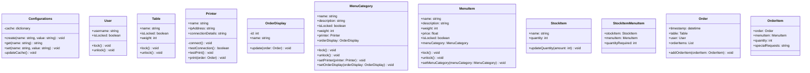

# Class Diagram

```mermaid
classDiagram
    class Configurations {
        -cache: dictionary<string, string>
        +create(name: string, value: string) void
        +get(name: string) string
        +set(name: string, value: string) void
        -updateCache() void
    }
    
    class User {
        +username: string
        +isLocked: boolean
        +lock() void
        +unlock() void
    }
    
    class Table {
        +name: string
        +isLocked: boolean
        +weight: int
        +lock() void
        +unlock() void
    }
    
    class Printer {
        +name: string
        +ipAddress: string
        +connectionDetails: string
        -connect() void
        +testConnection() boolean
        +testPrint() void
        +print(order: Order) void
    }
    
    
    %% Order Displays will be implemented probably in the future, but for now we will just have a placeholder class for it
    class OrderDisplay { 
        -id: int
        +name: string
        +update(order: Order) void
    }
    
    class MenuCategory {
        +name: string
        +description: string
        +isLocked: boolean
        +weight: int
        +printer: Printer
        +orderDisplay: OrderDisplay
        +lock() void
        +unlock() void
        +setPrinter(printer: Printer) void
        +setOrderDisplay(orderDisplay: OrderDisplay) void
    }
    
    class MenuItem {
        +name: string
        +description: string
        +weight: int
        +price: float
        +isLocked: boolean
        +menuCategory: MenuCategory
        +lock() void
        +unlock() void
        +setMenuCategory(menuCategory: MenuCategory) void
    }
    
    class StockItem {
        +name: string
        +quantity: int
        +updateQuantity(amount: int) void
    }
    
    class StockItemMenuItem {
        +stockItem: StockItem
        +menuItem: MenuItem
        +quantityRequired: int
    }
    
    class Order {
        +timestamp: datetime
        +table: Table
        +user: User
        +orderItems: List<OrderItem>
        +addOrderItem(orderItem: OrderItem) void
    }
    
    class OrderItem {
        +order: Order
        +menuItem: MenuItem
        +quantity: int
        +specialRequests: string
    }

```
