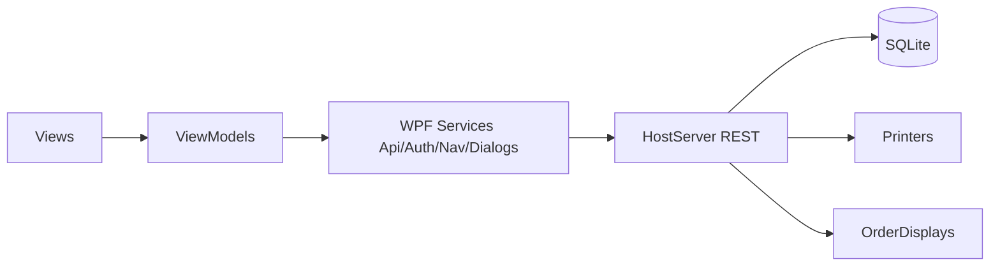
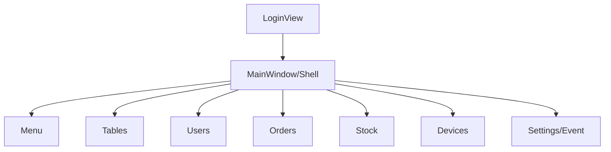

# MVVM Plan (WPF Desktop App)

## Ziele (MVP)
- Login + Token (Waiter: `username` + gemeinsamer `eventPasscode`)
- Menü: Kategorien + Items verwalten (CRUD, Lock, Routing Printer/Display)
- Tische: CRUD, Bulk A1–E5, Lock, QR/PDF Export
- User: CRUD, Lock
- Orders: Verlauf/Details (Filter)
- Lager: StockItems verwalten + Requirements pro MenuItem
- Devices: Printer/Display verwalten + Test-Print
- Settings: Config + Event Passcode anzeigen/rotieren + neues Event (neue DB Datei)

---

## Layer / Verantwortlichkeiten (nur Plan)
- `Models/Dtos`: API DTOs
- `Views`: XAML Screens
- `ViewModels`: UI State + Commands
- `Services/Api`: REST Client pro Resource
- `Services/Auth`: Token handling
- `Services/Navigation`: Screen navigation
- `Services/Dialogs`: Confirm/Message
- (Optional) `Services/Export`: QR/PDF

---

## Ordnerstruktur (Soll)
- `Models/`
  - `Dtos/`
- `Views/`
  - `Shell/`
  - `Auth/`
  - `Menu/`
  - `Tables/`
  - `Users/`
  - `Orders/`
  - `Stock/`
  - `Devices/`
  - `Settings/`
- `ViewModels/`
  - `Shell/`
  - `Auth/`
  - `Menu/`
  - `Tables/`
  - `Users/`
  - `Orders/`
  - `Stock/`
  - `Devices/`
  - `Settings/`
- `Services/`
  - `Api/`
  - `Auth/`
  - `Navigation/`
  - `Dialogs/`
  - `Export/` *(optional)*
- `Infrastructure/`
  - `Base/` *(ObservableObject, BaseViewModel)*
  - `Commands/` *(AsyncRelayCommand/RelayCommand)*

---

## Navigation Plan (Screens)

### Shell
- View: `Views/Shell/MainWindow.xaml`
- VM: `ViewModels/Shell/ShellViewModel`
- State: `CurrentViewModel`, `CurrentUser`, `IsAuthenticated`
- Commands: `Navigate(Menu/Tables/Users/Orders/Stock/Devices/Settings)`, `Logout`

### Login
- View: `Views/Auth/LoginView.xaml`
- VM: `ViewModels/Auth/LoginViewModel`
- State: `Username`, `EventPasscode`, `IsBusy`, `Error`
- Commands: `Login`

### Menü
- View: `Views/Menu/MenuManagementView.xaml`
- VM: `ViewModels/Menu/MenuManagementViewModel`
- State:
  - `Categories`, `SelectedCategory`
  - `Items`, `SelectedItem`
  - `Printers`, `Displays`
- Commands:
  - Categories: `LoadCategories`, `CreateCategory`, `UpdateCategory`, `DeleteCategory`, `ToggleCategoryLock`
  - Items: `LoadItems`, `CreateItem`, `UpdateItem`, `DeleteItem`, `ToggleItemLock`
  - Routing: `AssignPrinterToCategory`, `AssignDisplayToCategory`

### Tische
- View: `Views/Tables/TableManagementView.xaml`
- VM: `ViewModels/Tables/TableManagementViewModel`
- State:
  - `Tables`, `SelectedTable`
  - Bulk: `Rows`, `From`, `To`, `LockNew`
- Commands:
  - `LoadTables`, `CreateTable`, `UpdateTable`, `DeleteTable`, `ToggleTableLock`
  - `CreateBulkTables`
  - `ExportQrPdf` *(optional, wenn in WPF)*

### User
- View: `Views/Users/UserManagementView.xaml`
- VM: `ViewModels/Users/UserManagementViewModel`
- State: `Users`, `SelectedUser`, `SearchText`, `ShowLocked`
- Commands: `LoadUsers`, `CreateUser`, `UpdateUser`, `DeleteUser`, `ToggleUserLock`

### Orders
- View: `Views/Orders/OrderHistoryView.xaml`
- VM: `ViewModels/Orders/OrderHistoryViewModel`
- State:
  - `Orders`, `SelectedOrder`
  - Filter: `SelectedTable`, `SelectedUser`, `From`, `To`
- Commands: `SearchOrders`, `Refresh`, `OpenDetails`

- View: `Views/Orders/OrderDetailsView.xaml` *(optional)*
- VM: `ViewModels/Orders/OrderDetailsViewModel` *(optional)*
- State: `Order`
- Commands: `LoadOrder`

### Lager
- View: `Views/Stock/StockManagementView.xaml`
- VM: `ViewModels/Stock/StockManagementViewModel`
- State:
  - `StockItems`, `SelectedStockItem`
  - `MenuItems`, `SelectedMenuItem`
  - `Requirements`
- Commands:
  - Stock: `LoadStock`, `CreateStockItem`, `UpdateStockQuantity`, `DeleteStockItem`
  - Requirements: `LoadMenuItems`, `LoadRequirements`, `SaveRequirements`

### Devices
- View: `Views/Devices/DeviceManagementView.xaml`
- VM: `ViewModels/Devices/DeviceManagementViewModel`
- State: `Printers`, `SelectedPrinter`, `Displays`, `SelectedDisplay`
- Commands:
  - Printers: `LoadPrinters`, `CreatePrinter`, `UpdatePrinter`, `DeletePrinter`, `TestPrint`
  - Displays: `LoadDisplays`, `CreateDisplay`, `UpdateDisplay`, `DeleteDisplay`

### Settings / Event
- View: `Views/Settings/SettingsView.xaml`
- VM: `ViewModels/Settings/SettingsViewModel`
- State: `ConfigValues`, `EventName`, `EventPasscode`
- Commands: `LoadConfig`, `SaveConfig`, `CreateNewEvent`, `LoadEventPasscode`, `RotateEventPasscode`

---

## DTO Plan (Client)
- `AuthLoginRequestDto`: `username`, `eventPasscode`
- `AuthResponseDto`: `accessToken`, `expiresInSeconds`, `refreshToken?`, `user?`
- `UserDto`: `id`, `username`, `isLocked`
- `TableDto`: `id`, `name`, `weight`, `isLocked`
- `MenuCategoryDto`: `id`, `name`, `description`, `weight`, `isLocked`, `printerId?`, `orderDisplayId?`
- `MenuItemDto`: `id`, `name`, `description`, `price`, `weight`, `isLocked`, `menuCategoryId`
- `OrderDto`: `id`, `timestamp`, `tableId`, `userId`, `items: List<OrderItemDto>`
- `OrderItemDto`: `id`, `menuItemId`, `quantity`, `specialRequests?`
- `StockItemDto`: `id`, `name`, `quantity`
- `StockRequirementDto`: `stockItemId`, `quantityRequired`
- `PrinterDto`: `id`, `name`, `ipAddress`, `connectionDetails?`
- `OrderDisplayDto`: `id`, `name`, `ipAddress`, `connectionDetails?`
- `ConfigDto`: `values: Dictionary<string,string>`
- `EventPasscodeDto`: `eventPasscode`

---

## Api Services Plan (WPF)
- `IAuthApi`
  - `Login(username, eventPasscode)`
  - `Me()`
- `IUsersApi`
  - `GetUsers(locked?, search?)`, `CreateUser`, `PatchUser`, `DeleteUser`
- `ITablesApi`
  - `GetTables(locked?)`, `CreateTable`, `PatchTable`, `DeleteTable`, `BulkCreate`, `DownloadQrPdf` *(optional)*
- `IMenuApi`
  - `GetCategories`, `CreateCategory`, `PatchCategory`, `DeleteCategory`
  - `GetItems(categoryId?)`, `CreateItem`, `PatchItem`, `DeleteItem`
  - `PutStockRequirements(menuItemId, requirements)`
- `IOrdersApi`
  - `SearchOrders(tableId?, userId?, from?, to?)`
  - `GetOrder(orderId)`
- `IStockApi`
  - `GetStockItems`, `CreateStockItem`, `PatchStockItem`
- `IDevicesApi`
  - `GetPrinters`, `CreatePrinter`, `PatchPrinter`, `DeletePrinter`, `TestPrint`
  - `GetDisplays`, `CreateDisplay`, `PatchDisplay`, `DeleteDisplay`
- `IConfigApi`
  - `GetConfig`, `PatchConfig`
  - `CreateEvent(eventName)`
  - `GetEventPasscode()`
  - `SetEventPasscode(eventPasscode)`

---

## API Mapping (Endpunkte)
- Auth
  - `POST /api/auth/login` *(username + eventPasscode)*
  - `GET /api/auth/me`
- Users
  - `GET/POST /api/users`
  - `PATCH/DELETE /api/users/{id}`
- Tables
  - `GET/POST /api/tables`
  - `PATCH/DELETE /api/tables/{id}`
  - `POST /api/tables/bulk`
  - `GET /api/tables/qr.pdf` *(optional)*
- Menu
  - `GET/POST /api/menu/categories`
  - `PATCH/DELETE /api/menu/categories/{id}`
  - `GET/POST /api/menu/items`
  - `PATCH/DELETE /api/menu/items/{id}`
- Stock
  - `GET/POST /api/stock/items`
  - `PATCH /api/stock/items/{id}`
  - `PUT /api/menu/items/{menuItemId}/stock-requirements`
- Devices
  - `GET/POST /api/printers`
  - `PATCH/DELETE /api/printers/{id}`
  - `POST /api/printers/{id}/test-print`
  - `GET/POST /api/order-displays`
  - `PATCH/DELETE /api/order-displays/{id}`
- Orders
  - `GET /api/orders?tableId=&userId=&from=&to=`
  - `GET /api/orders/{id}`
- Config / Event
  - `GET/PATCH /api/config`
  - `POST /api/admin/events`
  - `GET /api/admin/event-passcode`
  - `PUT /api/admin/event-passcode`

---

## Mermaid (Plan)

### MVVM/Schichten

### Navigation Flow

