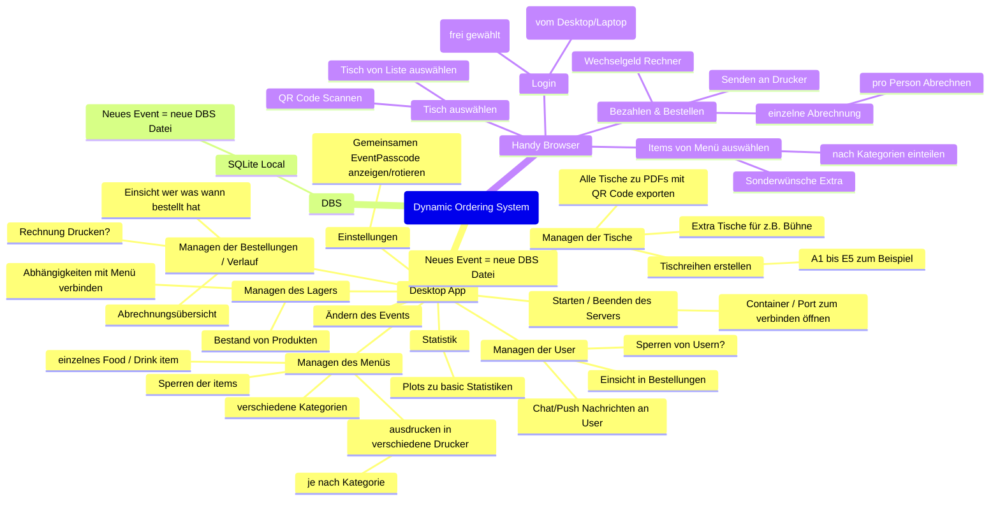

# mindmap

mindmap for The App Components

```mermaid
mindmap
    root(Dynamic Ordering System)
        Desktop App
            Starten / Beenden des Servers
                Container / Port zum verbinden öffnen
            Managen des Menüs
                einzelnes Food / Drink item
                Sperren der items
                verschiedene Kategorien
                ausdrucken in verschiedene Drucker 
                    je nach Kategorie
            Managen der Tische
                Tischreihen erstellen
                    A1 bis E5 zum Beispiel
                Extra Tische für z.B. Bühne
                Alle Tische zu PDFs mit QR Code exporten
            Managen der User
                Chat/Push Nachrichten an User
                Sperren von Usern?
                Einsicht in Bestellungen
            Managen des Lagers
                Bestand von Produkten
                Abhängigkeiten mit Menü verbinden
            Managen der Bestellungen / Verlauf
                Einsicht wer was wann bestellt hat
                Rechnung Drucken? 
                Abrechnungsübersicht
            Ändern des Events
                Neues Event = neue DBS Datei
            Statistik
                Plots zu basic Statistiken
            Einstellungen
                Gemeinsamen EventPasscode anzeigen/rotieren
        DBS
            SQLite Local
                Neues Event = neue DBS Datei
        Handy Browser
            Login
                Username (frei gewählt)
                EventPasscode (vom Desktop/Laptop)
            Tisch auswählen
                QR Code Scannen
                Tisch von Liste auswählen
            Items von Menü auswählen
                nach Kategorien einteilen
                Sonderwünsche Extra
            Bezahlen & Bestellen
                Senden an Drucker
                Wechselgeld Rechner
                einzelne Abrechnung
                    pro Person Abrechnen
```